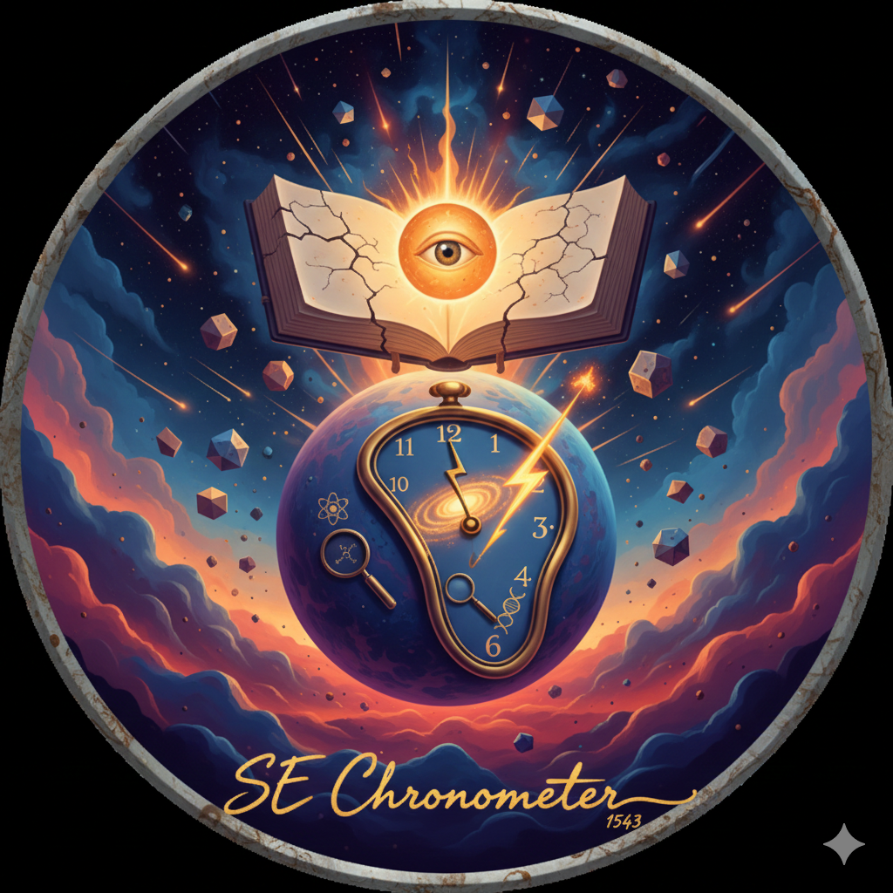

# The Scientific Era Chronometer (v1.0)
**Human Progress > Religious Tradition**

The Scientific Era (SE) Chronometer is a desktop application designed to strip away the theological infrastructure of modern timekeeping. It replaces the Gregorian calendar with a timeline based on human achievement and the physical laws of the universe.

## Core Features
- **Scientific Era Date:** Tracks years since 1543 (the publication of Copernicus's *De revolutionibus*).
- **True Solar Time:** Calculates time based on the Sun's actual position at your longitude, ignoring political time zones.
- **Lunar Tracking:** Real-time moon phase and illumination percentage.

## The Timeline
- **0 SE (1543):** The Copernican Revolution. Humanity accepts the Earth moves.
- **144 SE (1687):** Newtonian Physics. The universe becomes predictable.
- **345 SE (1888):** The Tesla Era. Mastery of Electromagnetism.
- **482 SE (Today):** Current progress of the Information Age.

## Installation
1. Install Python 3.x.
2. Download `se_clock.py`.
3. Run `python se_clock.py` in your terminal.
